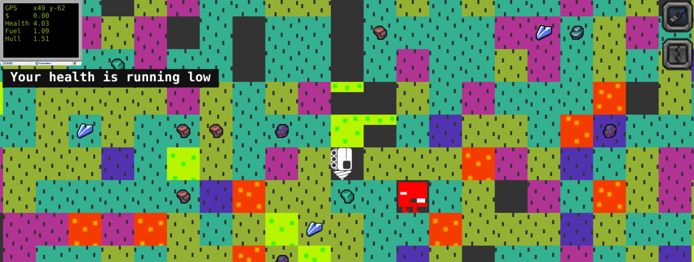

# Phaserload

## Prerequisites

1. Linux or UNIX
2. node.js [Check out NVM](https://github.com/creationix/nvm)


## Setup

1. npm i --only=dev
2. gulp setup


## Run

```./out/start``` can also be run with optional port: ```./out/start 1337```

### Problems

```sudo: node: command not found``` to fix this (if you used NVM) run: ```sudo ln -s "$NVM_DIR/versions/node/$(nvm version)/bin/node" "/usr/local/bin/node"```


## Screenshots

More in ```./screenshots```

