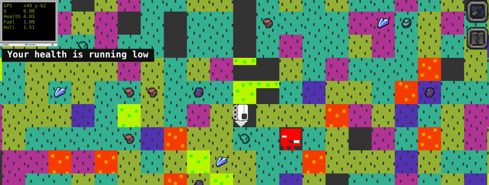

# Phaserload

A little phaser game that was inspired by the original flash-based motherload game on miniclip and penny arcade.

## Screenshots

More in [etc/screenshots](https://github.com/fatlard1993/phaserload/tree/master/etc/screenshots)

# TODO

* Build in pallet swapping instead of separate image source for each color difference: https://github.com/Colbydude/phaser-3-palette-swapping-example
* allow discarding material to lighten load
* add refurbished teleporters that sometimes don't work and sometimes aren't very accurate
* add engine upgrade to increase base speed
* initial fuel tank and cargo bay need to be MUCH less capacity
* player orientation should be decided and tracked server side
* spaceco_hurt1 frame is missing
* add mouse/touch control
* handle player/spaceco deaths
* make spaceco supplies finite
* add a spaceco refresh event where the spaceco items get refreshed and the materials are reset